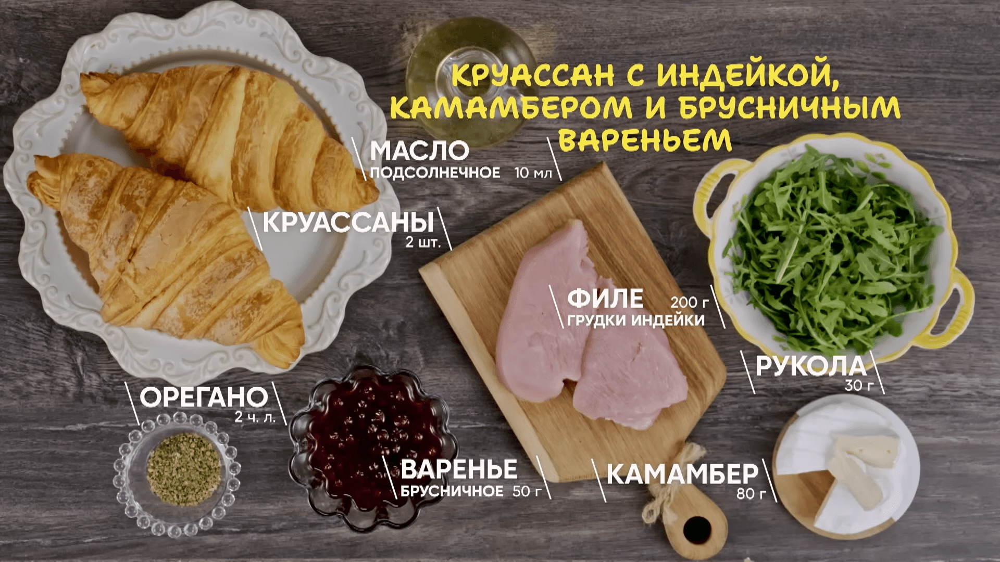

# Круассан с индейкой, сыром камамбер и брусничным вареньем

https://www.youtube.com/watch?v=Mo41tlTKOw0

## Ингредиенты\

## Приготовление

- Соль/перец/орегано на индейку
- Жарим индейку с двух сторон до корочки, затем под крышкой на медленном огне 5 мин 
- Камамбер слайсами, индейку слайсами 
- Возвращаем индейку, сверху камамбер, и пару минут под крышкой на слабом огне 
- Круассан разрезаем, выкладываем руколу, индейку, варенье