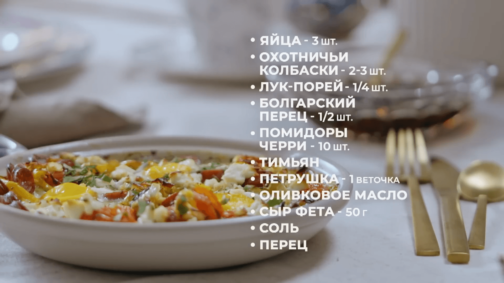

# Запеченная яичница с охотничьими колбасками и овощами 

- https://www.youtube.com/watch?v=g47CHEP_etE

## 

## Приготовление

0. Духовку на 180°
1. Лук порей нарезаем кольцами, моем 
2. Нарезаем перец, колбаски
3. Обжариваем лук, перец, колбаски
4. Черри пополам и в сковороду 
5. Соль, перец, тимьян добавляем
6. Делаем выемки, разбиваем яйца 
7. В духовку на 180° на 10 мин
8. Добавляем сыр, запекаем ещё 15 мин 
9. Украшаем зеленью 