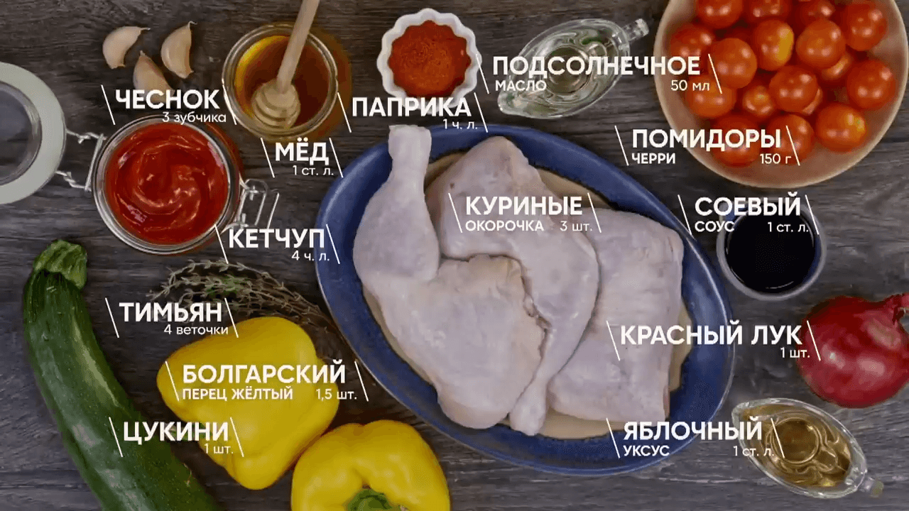

# Куриные окорочка с овощами

- https://vk.com/wall-39128795_105655
- https://www.youtube.com/watch?v=FHi2u7mdInY

## Ингредиенты:

- Куриные окорочка (бедро и голень с кожей) 3 шт.
- Болгарский перец жёлтый 1,5 шт.
- Цукини 1 шт.
- Красный лук 1 шт.
- Черри томаты 150 г
- Чеснок 3 зубчика
- Тимьян свежий 4 веточки
- Уксус яблочный 1 ст. л
- Подсолнечное масло 50 мл
- Соль/Перец по вкусу

### Глазировка:

- Кетчуп 4 ч. л
- Соевый соус 1 ст. л
- Мёд жидкий 1 ст. л
- Паприка 1 ч. л

## Приготовление

* На сковороду налить подсолнечное масло (20 мл) и подогреть, отправить окорочка на сковороду.
* Курицу во время приготовления посолить, поперчить и обжарить с двух сторон до коллера.
* Цуккини и перцы нарезать крупными кусками, а красный лук нарезать небольшими ломтиками.
* Чеснок нарезать слайсами и отправить к овощам.
* Снять листья с веточек тимьяна и отправить к овощам, поперчить, посолить, влить 1 ст. ложку уксуса и 30 мл
  подсолнечного масла, перемешать.
* Выключить нагрев и отправить овощи к курице, выложить между окорочками.
* И ещё забросить хаотично черри.
* Отправить сковороду с курицей и овощами в заранее разогретую до 200 градусов духовку на 20 минут с конвекцией и
  отстегнуть ручку от сковороды.

Глазировка:

* Смешать кетчуп, соевый соус, мёд и паприку.
* Вытащить из духовки сковороду и покрыть курицу глазировкой, отправить ещё на 15 минут.
* Готовому блюду дать время остыть и успокоиться.

Сервировка:

* На сервировочную тарелку переложить окорочок и овощи с соусом.

Приятного аппетита!