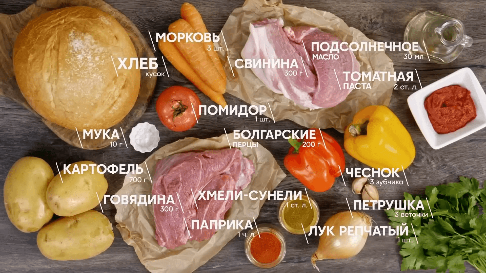

# Тефтели с овощами в одной сковороде

- https://www.youtube.com/watch?v=9njsFWXTkqQ
- https://vk.com/sashabelkovich?w=wall-39128795_61226

## Ингредиенты:

- Говядина тазобедренная часть 300 г
- Свинина шея 300 г
- Хмели - сунели 1 ст. ложка
- Паприка 1 ч. ложка
- Лук репчатый 1 шт.
- Морковь 3 шт.
- Чеснок 3 зубчика
- Болгарский перец красный 100 г
- Болгарский перец жёлтый 100 г
- Томатная паста 2 ст. ложки
- Картофель крупный 700 г
- Мука 10 г
- Помидор 1 шт.
- Петрушка 3 веточки
- Подсолнечное масло 30 мл
- Соль/Перец по вкусу

Для подачи:

- Каравай белый ½ шт.

## Приготовление:

* Говядину и свинину нарезать на средние кусочки, пропустить через мясорубку. К фаршу добавить соль по вкусу, хмели –
  сунели, паприку и хорошенько замешать. Отбить фарш, чтобы стал плотнее. Сформировать из фарша тефтели среднего
  размера, постоянно смачивая руки водой.
* На сковороду налить 20 мл подсолнечного масла и обжарить тефтели в течение 3-4 минут. Переложить в отдельную тарелку.
* Лук очистить и нарезать полукольцами, влить на сковороду 10 мл подсолнечного масла и обжарить лук.
* Морковь очистить и нарезать колечками, отправить к луку.
* Чеснок нарезать слайсами и отправить к овощам.
* Перцы нарезать кубиком и отправить к остальным овощам.
* Когда овощи обжарились, добавить 2 ст. ложки томатной пасты и немного пассеровать с овощами.
* Картофель очистить, нарезать крупными кусочками и переложить поверх обжаренных овощей. Затем сверху положить
  обжаренные тефтели.
* Залить водой овощи с тефтелями (на половину уровня тефтелей). Отдельно смешать 100 мл воды с мукой и влить в
  сковороду.
* Помидор нарезать крупными дольками и отправить к тефтелям, посолить по вкусу и добавить нарубленную петрушку (2
  веточки), накрыть крышкой и готовить на максимальном огне.
* Когда тефтели с овощами закипят, убавить огонь и томить ещё 30 минут.

Сервировка:

* Переложить порцию тефтелей с овощами в тарелку для подачи, украсить листиками петрушки и подавать с мягким хрустящим
  хлебом.

Приятного аппетита