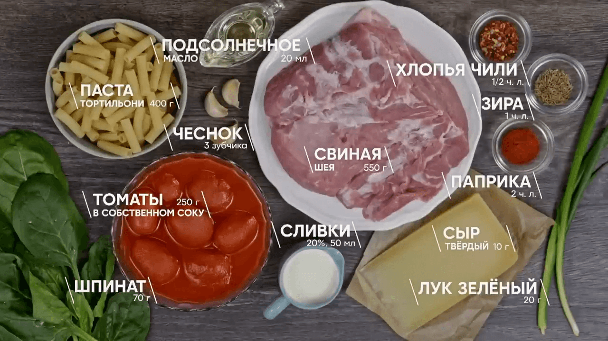

# Паста с мясным рагу и шпинатом

- https://vk.com/wall-39128795_104933
- https://www.youtube.com/watch?v=FHi2u7mdInY

## Ингредиенты:

- Свиная шея охлаждённая 550 г
- Тортильони паста 400 г
- Томаты в собственном соку 250 г
- Чеснок 3 зубчика
- Лук зелёный 20 г
- Сливки 22% 50 мл
- Шпинат свежий 70 г
- Зира зёрна 1 ч. л
- Хлопья чили ½ ч. л
- Паприка 2 ч. л
- Пармезан 50 г
- Подсолнечное масло 20 мл
- Соль/Перец по вкусу

## Приготовление:

* Мясо нарезать на крупные куски и пропустить через мясорубку.
* Зелёный лук нарезать средними колечками.
* На разогретую сковороду налить 20 мл подсолнечного масла и отправить лук, слегка обжарить и добавить фарш и
  измельчённый чеснок, обжарить на сильном огне.
* К мясу отправить зиру, хлопья чили, паприку, посолить и продолжить обжаривать ещё пару минут.
* Отправить макароны в кипящую солёную воду и варить 8-10 минут до состояния «аль дэнтэ».
* Откинуть пасту на сито и отправить в соус, хорошенько перемешать.
* Помидоры очистить от шкурок и мелко нарезать, отправить к свинине и влить томатный сок от томатов (100 мл).
* Влить немного горячей воды от пасты и томить ещё 5 минут.
* Затем влить сливки и перемешать, довести до кипения на медленном нагреве и снять с нагрева.
* Шпинат нарезать крупными кусочками и отправить к пасте, влить ещё пару половников воды от пасты и перемешать.

Сервировка:

* Переложить порцию пасты на сервировочную тарелку и посыпать тёртым твёрдым сыром.

Приятного аппетита!