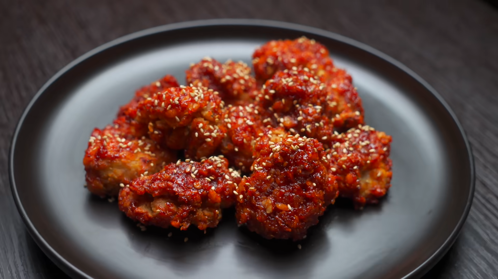

# Корейский чикен в соусе Яннём (+ закуски)

## Ингредиенты:

- Филе куриных бёдер - 500 г.
- Мука пшеничная - 130 г.
- Мука пшеничная - 120-200 г. для обвалки
- Молоко - 100-150 мл.
- Соль, перец по вкусу.
- Чесночный порошок - 2-3 щепотки
- Карри - 2-3 щепотки.

### Соус:

- Соевый соус - 3 ст.л.
- Кетчуп - 3 ст.л.
- Сахар - 2 ст.л.
- Кочудян - 1 ст.л.
- Кукурузный сироп - 2 ст.л.
- Чеснок измельченный - 2 ст.л.
- Красный перец кочукару - 1 ч.л.

## Приготовление

- Нарезайте курицу на порционные кусочки, не слишком мелко.
- Посолите, поперчите, добавьте сушёный чеснок и карри.
- Залейте курицу 150 мл молока для мягкости.
- Дайте настояться 2 часа или 30 минут.
- Добавьте 130 г муки в молоко, перемешайте до однородной массы.
- Обваляйте кусочки курицы в муке.
- Нагрейте масло до 170 градусов.
- Жарьте курицу 7 минут, дайте отдохнуть пару минут и затем повторите жарку ещё 1.5–2 минуты.
- Смешайте соевый соус, пасту кочудян, молотый перец кочукару, чеснок, сахар, кукурузный сироп и кетчуп.
- Готовьте соус на умеренном огне, регулярно помешивая.
- Перемешайте курицу с соусом на сковороде.
- Посыпьте кунжутом и подавайте.

## Закуски

### Редиска

- Нарезать редиску кружочками.
- Добавить 1 ч. ложку **соли**, оставить на 10 минут, слить сок.
- Заправить: **рисовый уксус (1 ст. ложка), сахар (0.5 ч. ложки), капля кунжутного масла, щепотка кочукару (или красного
  перца).**
- Дать постоять 10 минут.

### Пряный огуречный салат Oi Muchim

Быстрый, освежающий и очень ароматный. Остроту можно регулировать количеством кочудяна.

**Ингредиенты:**

- Огурцы (лучше короткие, пупырчатые) — 3–4 шт.
- Зеленый лук — 2 пера
- Кунжутное масло — 1 ст. ложка
- Кочудян (корейская перечная паста) — 1 ст. ложка (можно меньше)
- Чеснок — 2 зубчика, мелко
- Рисовый уксус — 1 ч. ложка
- Соевый соус — 1 ч. ложка
- Сахар — 1 ч. ложка
- Кунжут — 1 ч. ложка
- Соль — для присыпки огурцов

**Приготовление:**

1. **Подготовка огурцов:** Огурцы вымойте. Нарежьте кружками толщиной 0.5–1 см (или брусочками, как нравится). Сложите в
   дуршлаг, присыпьте солью (1 ч. ложка), перемешайте, оставьте на 15 минут. Затем промойте холодной водой и слегка
   отожмите.
   > Это уберет лишнюю влагу и сделает огурцы плотнее и хрустящее.
2. **Заправка:** В миске смешайте кочудян, кунжутное масло, уксус, соевый соус, сахар, чеснок. Получится густоватая
   паста.
3. **Смешивание:** Добавьте к огурцам нарезанный кольцами зеленый лук. Положите заправку. Аккуратно перемешайте руками (
   в перчатках, если не любите жечь пальцы).
4. **Подача:** Посыпьте кунжутом. Можно подавать сразу или дать постоять 10 минут — станет только вкуснее.

> **Совет:** Если нет кочудяна, замените на 1 ч. ложку молотой паприки + 0.5 ч. ложки острого перца + немного воды для
> пастообразности, но вкус будет не тот.

## Ссылки

- [FoodKor: За этой КОРЕЙСКОЙ курицей люди стоят в очереди! И я раскрыл ее секрет](https://www.youtube.com/watch?v=P2yG2-7SAvU)
- [Deepseek: Гарниры к корейскому чикену](https://chat.deepseek.com/a/chat/s/ec82b207-2da1-4cb2-a972-9eabe4f1207b)
