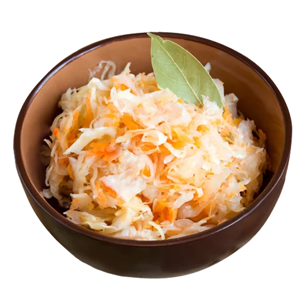

# Квашеная капуста / Капуста по-гурьевски

## Классический вариант

### Ингредиенты

- Капуста 2-3 кг
- Морковь = Капуста / 10 = 200-300 г
- Соль = 20 г / кг капусты = 40-60 г
- Кастрюля 5л
- Контейнер для ферментации 4л
- Перчатки

### Рецепт

- 1 кг капусты шинкуем, закидываем в большую кастрюлю
- Морковь (100 г) натираем на терке, добавляем к капусте
- Добавляем соль (20г)
- Надеваем перчатки, и жамкаем капусту на протяжении 10 минут, должно выделиться много сока
- Помещаем в контейнер для ферментации, сок должен покрывать всю капусту
    - чтобы сока выделилось больше капусту нужно прижимать
    - если сока все равно мало, можно долить воды или прижать капусту
- Повторяем для 2 кг капусты
- Закрываем контейнер, оставляем в тепле на 3-4 дня, каждый день проверяя все ли ок, можно снимать пену, если
  образовалась
- Спустя 3 дня пробуем, если вкус устраивает, то в холодильник и наслаждаемся

## Вариант с клюквой/брусникой

### Ингредиенты

- =классика
- Клюква/брусника = 50г / 1кг капусты
- (опц.) Тмин/семена укропа - 1чл / 3кг капусты

### Рецепт

- =классика
- Но добавляем клюква/брусника (50г) к капусте перед жамканьем, и жамкаем аккуратно, чтобы не раздавить все ягоды
- (опц.) Тмин/семена укропа добавляем для аромата перед жамканьем

## По-гурьевски / По-грузински

### Классика

#### Ингредиенты

- Капуста — 1 кочан (2-2,5 кг)
- Свекла — 1 шт.
- Чеснок — 1 головка (зубчики)
- Перец острый стручковый — 1 шт.
- Перец черный горошком — 10-12 шт.
- Соль — 2 ст. ложки (без горки)
- Вода — 2 литра

#### Приготовление

- Нарезка: Капусту нарежьте крупными кусками (дольками) вместе с кочерыжкой, чтобы листья не распадались. Свеклу
  нарежьте тонкими кружочками или ломтиками. Чеснок можно оставить зубчиками целиком или порезать пластинками. Перец
  нарежьте колечками .
- Укладка: В глубокую кастрюлю или ведерко укладывайте овощи слоями: куски капусты, затем свекла, чеснок, немного
  острого перца и горошины черного перца. Повторяйте слои, пока не заполните тару, оставив около 5 см до верха .
- Рассол: Вскипятите воду, добавьте соль и размешайте до полного растворения. Рассол должен быть чуть солонее, чем вы
  привыкли .
- Заливка: Залейте содержимое горячим рассолом.
- Гнет: Накройте тарелкой и поставьте груз (например, банку с водой). Оставьте при комнатной температуре .
- Ожидание: Процесс займет от 4 до 6 дней .
- Хранение: Готовую капусту переложите в банки, залейте этим же рассолом и храните в холодильнике.

### Быстрый вариант

> На вкус как морковка по-корейски

#### Ингредиенты

- Капуста белокочанная — 1 кочан (примерно 2 кг)
- Свекла — 1 средняя
- Морковь — 2 средние
- Чеснок — 1 головка

Для маринада:

- Вода — 1 литр
- Сахар — 1 стакан
- Соль — 2 ст. ложки
- Масло растительное — 1 стакан
- Уксус столовый (9%) — 150 мл (или 1/3 стакана яблочного уксуса )
- Лавровый лист — 2 шт.
- Перец черный горошком — 5-7 шт.
- Красный жгучий перец — небольшой кусочек (по желанию)

#### Приготовление

- Подготовка овощей: Капусту нарежьте крупными квадратиками (примерно 3х3 см) . Морковь и свеклу нашинкуйте тонкой
  соломкой (можно натереть на терке для корейской моркови). Чеснок измельчите .
- Смешивание: В большой миске или кастрюле перемешайте все нарезанные овощи.
- Приготовление маринада: В кастрюлю налейте воду, добавьте соль, сахар, растительное масло, лавровый лист и перец.
  Доведите до кипения и проварите 2-3 минуты. Снимите с огня и влейте уксус .
- Заливка: Залейте овощи горячим маринадом. Накройте тарелкой и поставьте небольшой гнет, чтобы капуста была полностью
  покрыта жидкостью .
- Ожидание: Оставьте при комнатной температуре на 24 часа .
- Хранение: Готовую капусту переложите в банки и уберите в холодильник .

## Ссылки

- [DeepSeek: Как сделать квашеную капусту дома](https://chat.deepseek.com/a/chat/s/732c1d78-004d-48fc-a9bf-c2a6a25359b3)
- [DeepSeek: Рецепты капусты по Гурьевски](https://chat.deepseek.com/a/chat/s/89baa87a-47fa-40fa-bfe8-8989853cf960)